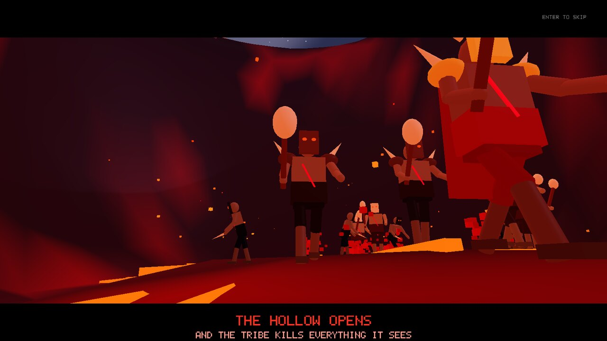
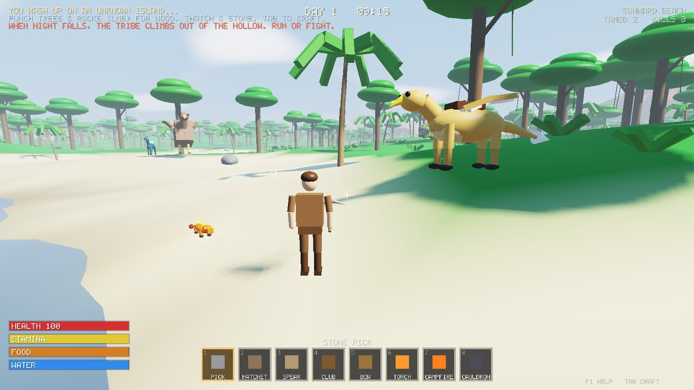
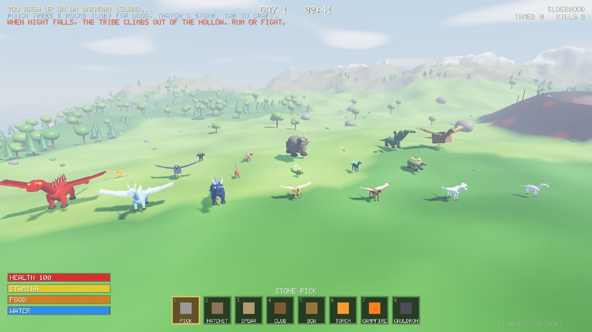
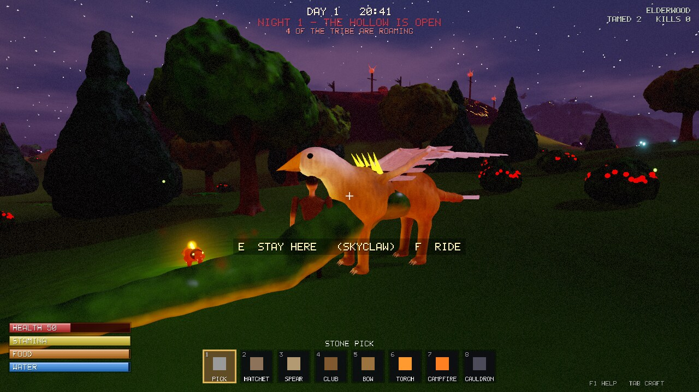
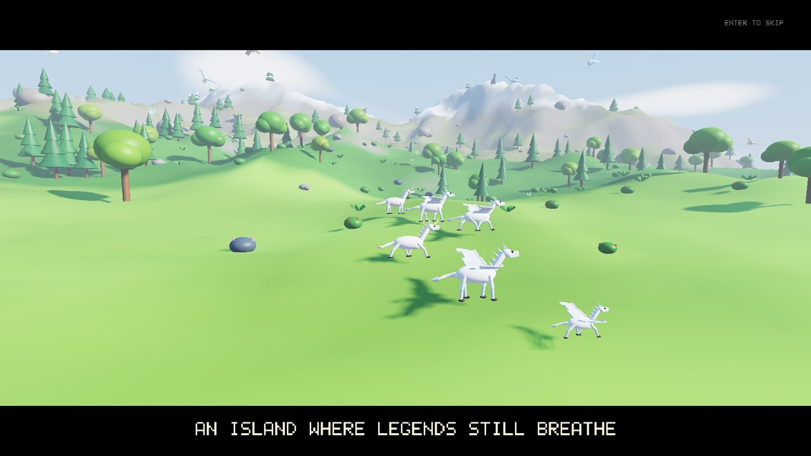
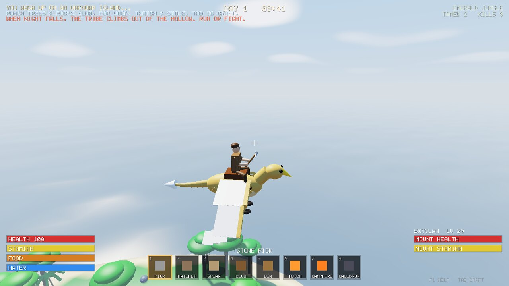
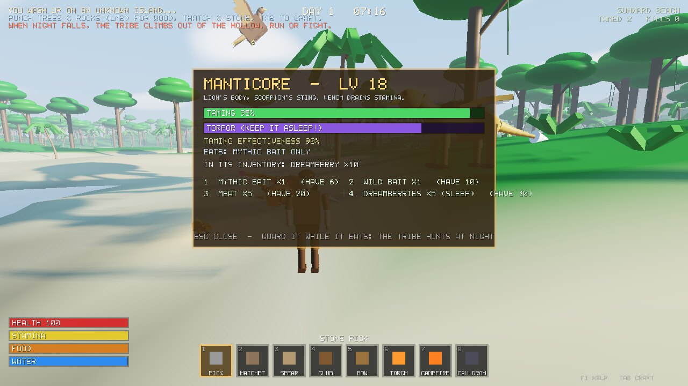
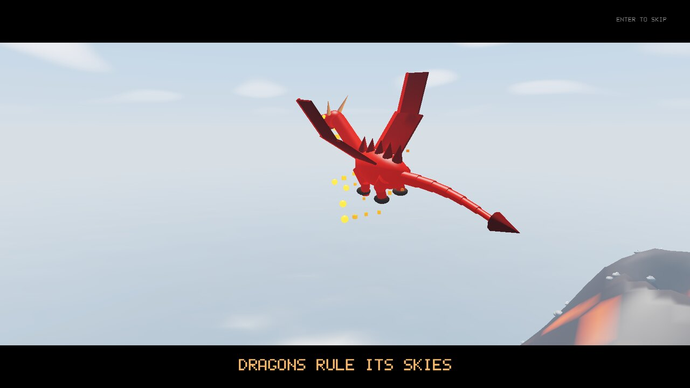
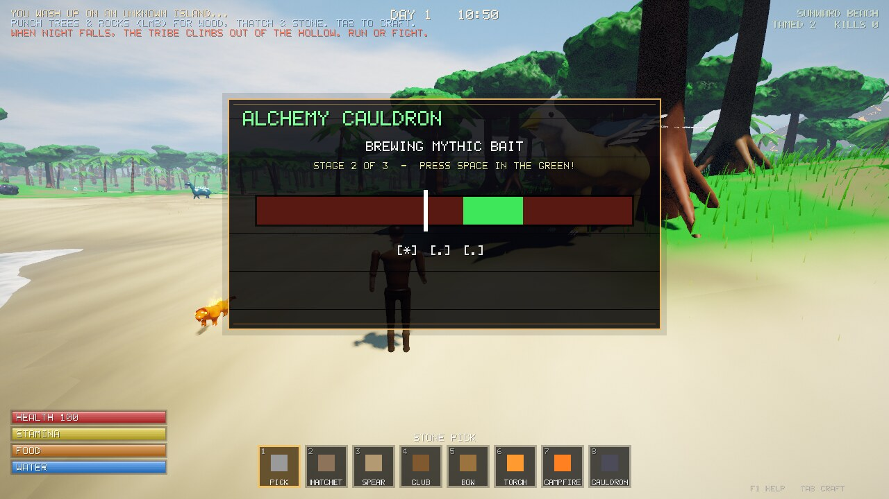

# MYTHBOUND

An ARK-style survival game with **mythical creatures instead of dinosaurs**. It runs on a
custom **C++ / Vulkan** engine written from scratch: no game engine, no model files
and no textures. Everything, from the island to the dragons and the tribe, is sculpted, animated
and textured in code.



You wash up on an island full of dragons, griffins, unicorns and stranger things. Gather,
craft, build and tame them. Every night a **tribe of infected people crawls out of the
Hollow**, a burning pit in the middle of the island. They're stronger than you and they kill
everything they see. They don't know where you are, so hide, run, swim or fight.

| | |
|---|---|
|  |  |
|  |  |
|  |  |
|  |  |

## Features

- **Boot trailer**: a 45-second cinematic rendered live in-engine, covering the ocean approach,
  a pegasus and unicorn herd, a fire dragon over the volcano, a griffin rider, sunset and the tribe
  climbing out of the Hollow. Press Enter to skip it or T on the title screen to watch it again.
- **21 mythical creatures**, each with its own body, animation, stats, diet and temperament:
  Fire Dragon, Frost Wyvern, Storm Drake, Griffin, Hippogriff, Pegasus, Unicorn, Phoenix,
  Thunderbird, Manticore, Basilisk, Kelpie, Mossback Tortoise, Jackalope, Hearth Salamander,
  Cerberus, Chimera, Behemoth, Kitsune, Hydra and Roc.
- **Three ways to tame:**
  - **Knockout (ARK style).** Hit a creature with a Knockout Club or Sleep Darts until it drops,
    then put food in its inventory. Dreamberries keep it asleep, and hitting it lowers its bonus
    levels. Rare and legendary creatures **only eat Mythic Bait**.
  - **Eggs.** Steal an egg from a dragon-kin nest (the parents will come after you) and set it by
    a campfire. Dragon eggs also need **Dragon Bait** before they'll hatch. The hatchling
    imprints on you and grows up.
  - **Babies.** Grab a baby Unicorn, Kitsune or Jackalope, outrun its angry family, then drop it
    at your camp and feed it.
- **Brewing minigame for bait.** Build a Cauldron and brew in three stages. Stop the needle
  in the green zone, which gets smaller and faster each stage. A perfect brew gives triple
  bait, and missing every stage ruins the batch.
- **The Hollow Tribe.** War bands (Warriors, Brutes, Stalkers, ranged Shamans and Chieftains)
  crawl out of the pit at night and roam the island in formation.
  - They only chase what they can **see**. Their vision cone is blocked by terrain, and crouching
    and darkness shrink how far they can see. When one spots you, the whole band hears the war cry.
  - They also kill wild and tamed creatures, and smash through walls.
  - They can't swim, and they get stronger every night.
  - Chieftains call more of the tribe out of the ground when wounded.
  - At dawn they retreat, and any left outside burn in the sunlight.
- **Survival**: health, stamina, hunger and thirst, plus cold at night in the Frostspire Peaks.
  You gather wood, thatch, stone, flint, fiber, berries, spirit herbs, crystal, metal and bone,
  and craft tools, weapons, a bow with arrows or sleep darts, torches, campfires, walls, spike
  walls and saddles.
- **Riding and flying.** Saddle up and ride your tames. Flyers take off, and mounts have bite and
  breath attacks. Big mounts harvest trees and rocks in one bite.
- **The island** is 1.3 km across with 9 biomes: beach, meadows, forest, jungle, highlands,
  snowy peaks, a volcanic wasteland and the corrupted Hollow. It has day and night, stars, clouds,
  and resources that grow back.

## The engine

It's written from scratch in C++17 against the **raw Vulkan API**, and needs no Vulkan SDK to run or build.

- **Procedural modelling.** Every creature, person, tree and rock is sculpted in code at startup.
  Each one is built from smoothly blended shapes and turned into a mesh by a hand-written
  surface-nets mesher, with baked ambient occlusion, colour blending, countershading and
  markings. All 21 creatures and 6 humanoids take about 1 second.
- **Skeletal animation.** Creatures and people have skeletons (up to 38 bones) and are skinned
  on the GPU. Walk cycles, wing flaps, tail sway, jaw bites, hydra necks, serpent slithering,
  sleeping poses, attack swings and riding poses are all animated in code.
- **HDR rendering pipeline:**
  - two-cascade 4096×2048 shadow map with rotated-Poisson soft PCF, alpha-tested for foliage
  - 4x MSAA, with alpha-to-coverage-style dithered sample masks for leaves and feathers
  - screen-space ambient occlusion and screen-space god rays (both at half resolution)
  - bloom (5-level down/up chain)
  - ACES tone mapping
  - colour grading (S-curve, warm highlights and cool shadows), sharpening, subtle chromatic
    aberration, vignette and film grain
- **Foliage and feathers.** Trees carry thousands of procedurally shaped leaf, needle and frond
  cards around a sculpted canopy core. Flying creatures have individual primary, secondary and
  covert feather cards, and birds have fanned tail feathers.
- **Surface detail.** Shaders add overlapping scales on dragons, fur and feather sheen, bark
  ridges, rock normals, and glossy eyes with catchlights.
- **Sculpted camp.** Campfires, cauldrons, palisade walls, spike walls, nests and tribe totems
  are all modelled with glowing embers, brews and eye sockets.
- **Terrain detail.** Terrain is textured per pixel in the shader: dirt patches, layered rock
  strata, sand ripples, wet shorelines, snow sparkle, micro-normals, and glowing lava cracks
  carved into the volcano and the Hollow.
- **GPU grass.** 90,000 animated blades and wildflowers around the camera, placed entirely in the
  vertex shader from a height and density map. They sway in the wind and bend away from the player.
- **Water.** Shallows are clear and deepen by depth, with shoreline foam, animated ripples,
  fresnel sky reflections and sun glints.
- **Sky.** Lit fluffy clouds with silver linings, a sun with glow, a moon (it turns red when the
  Hollow is open), and twinkling stars with a faint galaxy band.
- **Particles.** Soft blended particles for fire, smoke, embers, fireflies, the phoenix's trail,
  dragon breath and magic bolts.
- **Lighting.** Up to 16 dynamic point lights (campfires, torches, fire creatures, the Hollow's
  glow), plus hemisphere ambient, specular and foliage translucency.
- **Performance.** Instanced rendering with level-of-detail meshes for distant props, frustum
  culling, and distant props left out of the shadow pass.

## Building

You need **CMake 3.16+**, a **C++17 compiler** and a **graphics driver with Vulkan support**.
Almost every GPU from the last ten years supports Vulkan.

**Windows** (Visual Studio 2019/2022). CMake downloads GLFW and the Vulkan headers automatically:
```
cmake -S . -B build
cmake --build build --config Release
build\Release\mythbound.exe
```

**Linux** (Ubuntu/Debian):
```
sudo apt install cmake g++ libglfw3-dev libvulkan-dev glslang-tools
cmake -S . -B build -DCMAKE_BUILD_TYPE=Release
cmake --build build -j
./build/mythbound
```
If you don't install `libglfw3-dev`, CMake fetches GLFW itself. `glslang-tools` is optional,
because the compiled shaders are committed in `shaders/spv/` and CMake only recompiles them when
it finds `glslangValidator`.

macOS isn't supported yet (it would need MoltenVK).

## Controls

| Key | Action |
|---|---|
| WASD / Mouse | Move / look |
| Shift | Sprint |
| Space | Jump (fly up while riding a flyer) |
| Ctrl / C | Crouch, which makes you harder for the tribe to spot (fly down while riding) |
| LMB | Attack, gather, harvest corpses or place a building |
| RMB | Breath attack while riding a fire, frost, lightning or acid creature |
| 1–8, mouse wheel | Hotbar / camera zoom |
| E | Interact: feed a knocked-out creature, grab an egg or baby, cook, brew, drink, follow/stay |
| F | Ride / dismount (needs a Saddle) |
| Q | Drop a carried egg or baby (by a campfire to hatch or bond) |
| X | Eat |
| R | Switch bow ammo (arrows or sleep darts) / rotate a building |
| Tab | Inventory and crafting |
| F1 | How to survive |
| F12 | Screenshot |
| Esc | Pause |

## Command line

```
--skip-trailer            start straight on the island
--fullscreen              borderless fullscreen
--windowed W H            window size
--demo                    start with tools, bait and a tamed griffin
--time T                  time of day 0..1 (0.5 = noon, 0.85 = night)
--validation              enable the Vulkan validation layers
--selftest                run the automated gameplay tests
```

## Tests

`mythbound --selftest` runs the real simulation code and checks the core loops:

- knockout taming with a club and with sleep darts
- rare creatures refusing anything but Mythic Bait
- dragon eggs needing a campfire and Dragon Bait
- baby stealing, including the parents fighting back
- the tribe ignoring a player it can't see, hunting what it does see, and alerting its band
- burning at dawn
- crafting
- a full sunset-to-sunrise soak test

CI builds the game on Linux and Windows and runs the tests on a software Vulkan driver.

## Code map

| File | What it does |
|---|---|
| `src/renderer.*`, `src/vk_funcs.*`, `shaders/` | Vulkan engine: shadows, HDR + MSAA, skinning, grass, water, SSAO, god rays, bloom, grading |
| `src/world.*` | Island generation, biomes, the Hollow, resource props |
| `src/data.*` | Creature species, items, recipes, tribe classes. **Start here to add content** |
| `src/creatures.cpp` | Creature AI, taming, eggs, babies, wildlife respawns |
| `src/tribe.cpp` | Infected tribe: war bands, formations, sight, hunting, dawn |
| `src/player.cpp` | Movement, survival stats, gathering, combat, riding, building |
| `src/combat.cpp` | Damage, knockouts, projectiles, particles, collisions |
| `src/meshgen.*` | Signed-distance-field modeller + surface nets mesher |
| `src/models.*` | Creature / humanoid skeletons and sculpts, trees, rocks, plants, camp structures |
| `src/draw.cpp` | Animation, scene assembly, lighting and shadow cascades |
| `src/ui.cpp` | HUD, crafting, taming and brewing panels, SDF shapes and a vector stroke font |
| `src/trailer.cpp` | The boot trailer |
| `src/selftest.cpp` | Automated gameplay tests |
